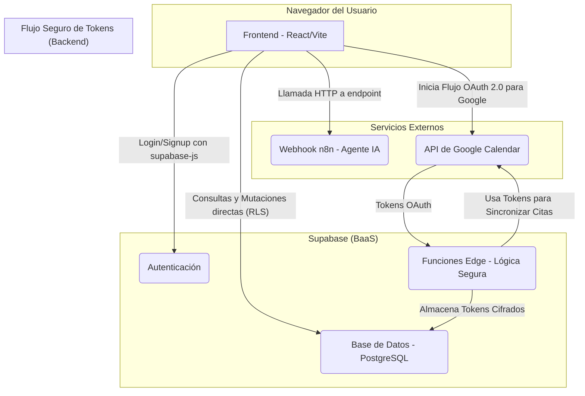

# Patrones de Sistema: Prospect Flow - Tu Casa Ideal

Este documento describe la arquitectura general del sistema y los flujos de datos entre sus componentes principales.

## 1. Diagrama de Arquitectura

El sistema sigue una arquitectura desacoplada, con el frontend actuando como el cliente principal que consume servicios de backend (BaaS) y APIs externas.

## 2. Descripción de Componentes y Flujos

### Frontend (Cliente Principal)
*   **Tecnología:** Aplicación de una sola página (SPA) construida con React, TypeScript y Vite.
*   **Responsabilidad:** Renderizar la interfaz de usuario, gestionar el estado local y comunicarse directamente con los servicios de backend.
*   **Acceso a Datos:** Utiliza la librería cliente `supabase-js` para interactuar directamente con Supabase, encargándose de la autenticación del usuario y las operaciones (CRUD) en la base de datos. La seguridad está garantizada por las Políticas de Seguridad a Nivel de Fila (RLS) de Supabase.

### Backend (BaaS - Supabase)
*   **Servicio:** [Supabase](https://supabase.com/) en su versión cloud.
*   **Autenticación:** Gestiona el registro, inicio de sesión y manejo de sesiones de usuarios de forma nativa.
*   **Base de Datos:** Una instancia de PostgreSQL donde se almacenan todos los datos de la aplicación.
*   **Lógica Segura (Funciones Edge):** Se utilizarán para manejar operaciones sensibles que no deben exponerse al cliente, principalmente el almacenamiento y refresco de los tokens de OAuth 2.0 para la integración con Google Calendar.

### Agente de IA (n8n)
*   **Integración:** Se realizará a través de un **endpoint de webhook** proporcionado.
*   **Flujo:**
    1.  El usuario interactúa con el componente de IA en el frontend.
    2.  El frontend envía una solicitud `POST` al endpoint del webhook con la consulta del usuario.
    3.  `n8n` recibe la solicitud, ejecuta su flujo de trabajo (que puede incluir consultar la base de datos de Supabase o llamar a una API de IA externa) y devuelve la respuesta.
    4.  El frontend recibe la respuesta y la muestra al usuario.

### Integración con Google Calendar
*   **Autorización:** Se implementará el flujo estándar de **OAuth 2.0**.
*   **Flujo de Manejo de Tokens:**
    1.  El usuario inicia el proceso de conexión con Google desde la interfaz.
    2.  Tras la autorización exitosa, Google redirige a una **Función Edge de Supabase**.
    3.  Esta función segura recibe los `access_token` y `refresh_token`.
    4.  Los tokens se cifran y se almacenan en una tabla específica en la base de datos de Supabase, asociados al ID del usuario.
    5.  Las futuras interacciones con la API de Google Calendar (crear, actualizar citas) se realizarán desde el backend (posiblemente otra Función Edge) utilizando los tokens almacenados, para no exponerlos en el frontend. 